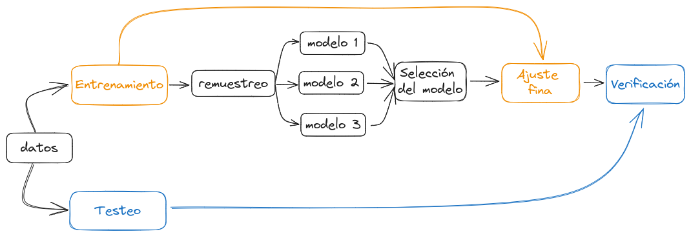

```{r setup, include=FALSE}
knitr::opts_chunk$set(echo = TRUE)

library(tidyverse)
library(tidymodels)

theme_set(theme_minimal())
```

## ¿Porqué tidymodels?

Tidymodels es en realidad un conjunto de paquetes de R que, al igual que Tidyverse, busca unificar la sintaxis y modo de uso al alrededor del modelado estadístico de datos. A diferencia de Tidyverse, Tidymodels no implementa nuevas maneras de, por ejemplo, aplicar el modelo lineal, si no que genera una interfaz única a partir de la cual utilizar las funciones que ya existen. De la misma manera, la salida que genera es consistente a lo largo de distintos modelos e implementaciones, y mejor aún en formato tidy.

Los principales paquete de Tidymodels son:

|                                                  |                                                                 |                                                                  |
|-----------|------------------------------------------------------|-------|
| [`rsample`](https://rsample.tidymodels.org/)     | Para dividir y hacer remuestreo de los datos                    | {width="50"}   |
| [`recipes`](https://recipes.tidymodels.org/)     | Preprocesamiento de los datos de manera ordenada y reproducible | {width="50"}   |
| [`parsnip`](https://parsnip.tidymodels.org/)     | Interfaz unificada para modelar datos                           | {width="50"}   |
| [`workflows`](https://workflows.tidymodels.org/) | Organiza el preprocesamiento, el modelado y postprocesa         | {width="50"} |
| [`yardstick`](https://yardstick.tidymodels.org/) | Mide la efectividad de los modelos                              | {width="50"} |
| [`broom`](https://broom.tidymodels.org/)         | Resume la salida de modelos en formato tidy                     | {width="50"}     |

pero hay muchos otros con objetivos específicos que completan el universo de tidymodels.

## El proceso de modelado de datos

Este diagrama muestra el proceso de modelado de datos teórico. Por supuesto, en la realidad vamos y venimos entre los distintos pasos hasta ajustar cada detalle. Pero es importante tener en cuenta algunos detalles:

-   **Cómo aprovechar los datos:** es importante hacer un "presupuesto" para planificar cómo vamos a usar los datos. Si usamos el 100% de nuestra muestra en el entrenamiento de un modelo, luego no podremos hacer ningún tipo de verificación (el modelo ya conoce los datos, cualquier resultado no será válido). Por eso necesitamos dividir los datos en (al menos) entrenamiento y testeo. Usaremos `rsample` para esta tarea.

-   **Qué modelo utilizar:** la mayoría de las veces no sabremos cual es el mejor modelo a aplicar, dependerá en parte de nuestro objetivo: queremos hacer describir, hacer inferencias o predecir a partir de los datos? Lo interensante es probar distintos modelos para quedarnos con el mejor o utilizar una combinación. Para esto es necesario hacer un remuestreo de los datos de entrenamiento y así hacer comparaciones válidas.

-   **La verificación:** es importante hacer una verificación tanto cualitativa (visual) como cuantitativa con los el subset de testeo, pero nunca con los datos de entrenamiento!



## Datos de cultivos

Vamos a trabajar con datos de rendimiento de cultivos que incluyen información sobre la floración, la altura del cultivo, la campaña, el tipo de ensayo, la distacia entre surcos entre otras cosas. Con esta información intentaremos generar un modelo que nos permita predecir la variable aceite_porcentaje.


```{r lectura de datos}
cultivos <- read_csv("https://raw.githubusercontent.com/paocorrales/intro-tidymodels-agro/main/datos/cultivos.csv")
```

La variable `aceite_porcentaje` tiene la siguiente distribucuón:

```{r message=FALSE, warning=FALSE}
cultivos %>% 
  ggplot(aes(aceite_porcentaje)) +
  geom_histogram(color = "white") +
  geom_rug(alpha = 0.1)
```

### Preparando los datos

Esta base de datos tiene en total `r nrow(cultivos)` registros de distintos ensayos de cultivos. Vamos a dividir los datos en 2 subsets de entrenamiento (`cultivos_train`) y testeo (`cultivos_test`). En primer lugar la función  `initial_split()` divide los datos en 2 utilizando el argumento `prop` para definir cuantos datos iran a cada subset. En ese caso usamos por defecto `3/4`, es decir, el 75% de los datos iran al entrenamiento y el 25% quedará para el testeo. Decidir este porcentaje es un problea en si mismo! 

```{r}
set.seed(91)
cultivos_split <- initial_split(cultivos, 
                           prop = 3/4)

cultivos_split
```

En segundo lugar, con `training()` y `testing()` extraemos los 2 subsets de datos a partir del objeto que generamos recién. 

```{r}
cultivos_train <- training(cultivos_split)
cultivos_test <- testing(cultivos_split)
```

Veamos ahora que pinta tiene nuestra variable de interes en relación con otras, por ejemplo `densidad_sem`. Inicialmente no parece haber una relación muy clara.

```{r message=FALSE, warning=FALSE}
cultivos_train %>% 
  ggplot(aes(densidad_sem, aceite_porcentaje)) +
  geom_smooth() 
```

Sin embargo si incluimos `tipo_siempra` como tercera variable, vemos que esta nueva variable podría llegar a explicar, en parte el comportamiento de `aceite_porcentaje`. 

```{r message=FALSE, warning=FALSE}
cultivos_train %>% 
  ggplot(aes(densidad_sem, aceite_porcentaje)) +
  geom_smooth(aes(color = tipo_siembra)) 
```

Comencemos ahora con el preprocesamiento de los datos. Para esto crearemos una *receta*, es decir una serie de pasos que realicen las transformaciones necesaria para dejar los datos listos para el modelado. A diferencia de otras implementaciones con tidymodel separamos completamente el preprocesamiento del modelado. De esta manera *modularizamos* el proceso y podemos utilizar la misma receta para aplicar modelos distintos. 

Crearemos la receta con los datos de entrenamiento pero luego podremos aplicar estos pasos también a los datos de testeo. Iniciamos la receta con la función `recipe()` indicando la formula, en este caso queremos evaluar la relación de `aceite_porcentaje` en función de todas las otras variables.

```{r}
receta_aceite <- 
  recipe(aceite_porcentaje ~ ., data = cultivos_train) 
```
El siguiente paso es trabajar con predictores categóricos, para esto sumamos un paso a la receta `step_dummy()` que convierte las variables nominales (caracteres o factores) en variables numéricas binarias. En este caso aplicamos el paso a todos os predictores nominales. Aquí vemos además que la receta es compatible con el uso de la `%>%` por lo que podemos ir sumando los paso uno detrás del otro.

```{r}
receta_aceite <- 
  recipe(aceite_porcentaje ~ ., data = cultivos_train) %>% 
  step_dummy(all_nominal_predictors())
```


```{r echo=FALSE}
print(receta_aceite)
```

En el siguiente paso `step_zv()` remueve las variables que contienen solo 1 valor único (si las hubiera), es decir con varianza cero.

```{r}
receta_aceite <- 
  recipe(aceite_porcentaje ~ ., data = cultivos_train) %>% 
  step_dummy(all_factor_predictors()) %>% 
  step_zv(all_predictors())
```

Cómo vimos que hay alguna relación entre `densidad_sem` y `tipo_siembra` vamos a sumar un nuevo paso que tenga en cuenta esa interacción. 

```{r}
receta_aceite <- 
  recipe(aceite_porcentaje ~ ., data = cultivos_train) %>% 
  step_dummy(all_factor_predictors()) %>% 
  step_zv(all_predictors()) %>% 
  step_interact(~ starts_with("densidad_sem"):starts_with("tipo_siembra"))
```

Finalmente aplicamos `step_normalize()` para normalizar todos los predictores. 

```{r}
receta_aceite <- 
  recipe(aceite_porcentaje ~ ., data = cultivos_train) %>% 
  step_dummy(all_factor_predictors()) %>% 
  step_zv(all_predictors()) %>% 
  step_interact(~ starts_with("densidad_sem"):starts_with("tipo_siembra")) %>% 
  step_normalize(all_numeric_predictors())
```

Y ahora si, tenemos nuestra receta.

```{r}
receta_aceite
```


Esta receta además, define claramente las transformaciones que hacemos en los datos por lo que es reproducible.

Podríamos encadenar la función `prep()` para *preparar* los datos usando la receta pero en nuestro caso ejecutaremos todos los pasos necesarios en un *workflow*.

### Definiendo el modelo

El siguiente paso es definir el modelo a aplicar. Nuevamente usamos tidymodels que tienen funciones que funcionan como interfaz con implementaciones en distintos paquetes. Podés revisar la lista de modelos disponibles [acá](https://parsnip.tidymodels.org/reference/index.html#models). En nuestro caso vamos a arrancar con el modelo linea usando la función `linear_reg()`.


```{r}
modelo_lineal <- 
  linear_reg() 
```

Por defecto esta función usa `lm` del paquete `stats` de R base pedro podríamos usar muchos otros *engines*, es decir, otras implementaciones al modelo lineal como `glm` y `glment`. Para setear un engine usamos `set_engine()`:


```{r}
modelo_lineal <- 
  linear_reg() %>% 
  set_engine("lm")
```

En algunos casos necesitaremos tener paquetes específicos instalados, por ejemplo `lme` requiere un extension del paquete `parsnip`. 

```{r}
modelo_lineal
```

Ya tenemos el segundo paso, el modelo. Pero como habrás notado, en ningún momento `modelo_lineal` se cruzó con nuestros datos. Vamos a unir todo en un workflow.

### Uninendo todo 

Un *workflow* es un obejto que incorpora toda la información necesaria para ajustar y hacer predicciones en base a un modelo. Iniciamos nuestro workflow con la función `workflow()`:

```{r}
wflow_lm <- 
  workflow()
```

Y luego con las funciones `add_model()` y `add_recipe()` agregamos el modelo y la receta que creamos recién. 

```{r}
wflow_lm <- 
  workflow() %>% 
  add_model(modelo_lineal) %>% 
  add_recipe(receta_aceite)
```

Como vemos el obejto `wflow_lm` tiene la información del modelo (`linear_reg()`) y el preprocesamiento con nuestra receta.

```{r}
wflow_lm
```

Con el workflow completo ahora si podemos ajustar el modelo usando los datos de entrenamiento:

```{r}
modelo_fit <- fit(wflow_lm, data = cultivos_train)
```

El objeto `modelo_fit` contiene muchísima información incluyendo el modelo, la receta y entre otras cosas nos permitirá extraer predicciones. Esto lo hacemos con la función `predict`

```{r}
predict(modelo_fit, new_data = cultivos_test) %>% 
  head()
```

Además de predecir el valor medio, también podemos estimar intervalos de confianza con la misma función:

```{r}
mean_predict <- predict(modelo_fit, cultivos_test)

conf_int_pred <- predict(modelo_fit, 
                         new_data = cultivos_test, 
                         type = "conf_int")
```
Esto genera un par de tibbles con columnas `.pred_lower` y `.pred_upper` que son los límites inferiores y superiores de ese intervalo de confianza. 

### Verificación

Veamos como le fue a nuestro modelo (spoiler alert: bastante mal). Primero vamos a graficar los valores predichos de `aceite_porcentaje` en función de los observados y que tenemos en nuestro subset de testeo.

```{r message=FALSE, warning=FALSE}
aceite_predic <- 
  cultivos_test %>% 
  bind_cols(mean_predict) 

ggplot(aceite_predic, aes(aceite_porcentaje, .pred)) +
  geom_abline(slope = 1, intercept = 0, color = "darkorange") +
      geom_point(alpha = 0.1) +
  geom_smooth(method = "lm") +
  labs(x = "Observado", y = "Predicho") +
  coord_equal(xlim = c(29,60), ylim = c(29, 60))

```

Si nuestro modelo fuera "perfecto" todos los puntos deberían caer alrededor de la linea naranja. Sin embargo tenemos puntos que se alejan bastante. Desde este punto de vista más cualitativo vemos que el modelo no es muy bueno. Calculemos ahora cual seria el error que cometeríamos si usamos el modelo para predecir un valor de `aceite_porcentaje` en el futuro.


```{r}
rmse(aceite_predic, aceite_porcentaje, .pred)
```

En este caso calculamos la raiz del error cuadrático medio o rmse con la función `rmse()` del paquee `yardsick`. El resultado es `r rmse(aceite_predic, aceite_porcentaje, .pred)$.estimate`, esto significa que al estimar `aceite_porcentaje` con el modelo cometemos en promedio un error de `r rmse(aceite_predic, aceite_porcentaje, .pred)$.estimate`.

#### Extra!

Una herramienta muy poderosa que implementa Tidymodels es el remuestreo. Esto es generar subsets de datos tomando datos de manera aleatoria a partir de un data set original. En este caso podemos aplicar el remuestreo para hacer un cálculo más robusto del error, generando muestras y calculando el error para cada una de ellas. 

```{r}
aceite_pred_remuestreo <- bind_rows(
  replicate(
    n = 10,
    expr = sample_n(aceite_predic, 500, replace = TRUE),
    simplify = FALSE
  ),
  .id = "resample"
)

errores <- aceite_pred_remuestreo %>%
  group_by(resample) %>%
  rmse(aceite_porcentaje, .pred)

errores
```

Tenemos ahora 10 estimaciones del error calculadas a partir de cada submuestra. Podemos calcular el promedio de esa estimación y compararla con el error que obtuvimos usando el subset de testeo completo.

```{r}
promedio <- errores %>% 
  summarise(rmse_promedio = mean(.estimate))
```

En este caso la diferencia es pequeña, ahora da `r promedio$rmse_promedio`, pero aún así la estimación es más robusta.

## Por donde seguir y de donde salió esto

Aquí dejamos una lista de los materiales que inspiraron este y que puede servir para continuar aprendiendo sobre Tidymodels.

En inglés:

* [Tidy Modeling with R](https://www.tmwr.org/), libro de Max Kuhn y Julia Silge
* [Tidymodels](https://www.tidymodels.org/), página con la documentación y ejemplos
* [Workshops de Tidymodels](https://workshops.tidymodels.org/) creados por el equipo que desarrolla los paquetes
* [An Introduction to tidymodels](https://topepo.github.io/2023-latinR), presentación en LatinR por Max Kuhn

En español:

* [Tidy Models, una introducción](https://diegokoz.github.io/EEA2019/clase%208/tidymodels.nb.html) por Diego Kozlowski y Juan Manuel Barriola